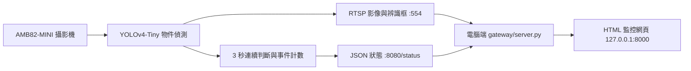

# AMB82-MINI 專注偵測系統

使用 Ameba AMB82-MINI 內建的 YOLOv4-Tiny 物件偵測功能，辨識畫面中的學生與手機。當人與手機的 Bounding Box（邊界框）持續重疊超過 3 秒，網頁會顯示「專心一下！」並將分心次數加一。

> 線上展示版：<https://amb82-focus-monitor.angus932011.chatgpt.site/><br>
> 展示網站無法直接存取區域網路中的 AMB82；實機監控請依照下方步驟啟動本機 Gateway（閘道）。

## 功能

- 在 AMB82-MINI 上執行 YOLOv4-Tiny，不需要把影像上傳到雲端辨識。
- 辨識 `person`（學生）與 `cell phone`（手機），並在 RTSP 畫面顯示辨識框。
- 即時顯示連續辨識到學生、手機與重疊的秒數。
- 人與手機框持續重疊 3 秒才提醒，手機短暫出現不計次。
- 低光源、遮擋或低信心結果不直接判定為分心。
- 同一次手機使用只計一次；手機離開 3 秒後才重新允許計數。
- 影像與辨識結果只在區域網路傳輸，程式不會儲存錄影。

## 系統架構



## 專案結構

```text
amb82-focus-monitor/
├── firmware/FocusMonitor/FocusMonitor.ino  # AMB82-MINI 韌體
├── gateway/server.py                       # 本機 RTSP/JSON 閘道
├── dist/
│   ├── index.html                          # 監控網頁
│   ├── app.js                              # 即時資料與介面邏輯
│   └── styles.css                          # 網頁樣式
└── README.md
```

## 準備項目

### 硬體

- Ameba AMB82-MINI
- AMB82-MINI 相容攝影機模組
- 可傳輸資料的 Micro USB 線
- 一台與 AMB82 連接相同 Wi-Fi 的電腦

### 軟體

- Arduino IDE 2.x
- Realtek AmebaPro2 開發板套件（本專案測試版本：4.1.1）
- Python 3（只使用標準函式庫，不需要 `pip install`）
- ffmpeg（將 RTSP 轉成瀏覽器可顯示的 MJPEG）

## 1. 下載專案

```sh
git clone https://github.com/Angus9312/amb82-focus-monitor.git
cd amb82-focus-monitor
```

也可以在 GitHub 按 `Code` → `Download ZIP`，下載後解壓縮。

## 2. 安裝 AMB82-MINI 開發板套件

1. 開啟 Arduino IDE。
2. 進入「設定（Preferences）」→「其他開發板管理員網址（Additional Boards Manager URLs）」。
3. 加入 Realtek 官方穩定版網址：

   ```text
   https://github.com/Ameba-AIoT/ameba-arduino-pro2/raw/main/Arduino_package/package_realtek_amebapro2_index.json
   ```

4. 開啟「開發板管理員（Boards Manager）」，搜尋並安裝 `Realtek Ameba Boards`。
5. 選擇「AmebaPro2 ARM (32-bits) Boards」→ `AMB82-MINI`。

官方安裝說明：<https://github.com/Ameba-AIoT/ameba-arduino-doc/blob/main/source/ameba_pro2/amb82-mini/Getting_Started/Getting%20Started%20with%20Ameba.rst>

## 3. 設定並燒錄韌體

1. 使用 Arduino IDE 開啟：

   ```text
   firmware/FocusMonitor/FocusMonitor.ino
   ```

2. 修改程式中的 Wi-Fi 資料：

   ```cpp
   char ssid[] = "YOUR_WIFI_SSID";
   char pass[] = "YOUR_WIFI_PASSWORD";
   ```

   請只在自己的電腦修改，不要把真實密碼提交到 GitHub。

3. 在 Arduino IDE 選擇 `AMB82-MINI` 與 AMB82 對應的 USB 連接埠。
4. 關閉序列監控視窗，避免連接埠被占用。
5. 如有需要，按住板上的 `UART_DOWNLOAD`，短按 `RESET`，再放開 `UART_DOWNLOAD`，讓開發板進入燒錄模式。
6. 按「上傳（Upload）」。看到 `Done uploading` 後按一下 `RESET`。
7. 開啟序列監控視窗並設定為 `115200 baud`，等待以下資訊：

   ```text
   AMB82 IP: 192.168.x.x
   RTSP: rtsp://192.168.x.x:554
   Status: http://192.168.x.x:8080/status
   ```

8. 在瀏覽器開啟序列監控顯示的 Status 網址。看到 JSON 表示 AMB82 狀態服務正常。

## 4. 安裝 ffmpeg

macOS（需要先安裝 Homebrew）：

```sh
brew install ffmpeg
```

Ubuntu／Debian：

```sh
sudo apt update
sudo apt install ffmpeg
```

Windows 可由 <https://ffmpeg.org/download.html> 下載，並將 `ffmpeg` 加入系統的 `PATH`。

安裝後可用以下指令確認：

```sh
ffmpeg -version
```

## 5. 啟動本機監控網頁

電腦與 AMB82-MINI 必須連接相同的區域網路。將下方 IP 換成序列監控顯示的 `AMB82 IP`：

```sh
python3 gateway/server.py --board-ip 192.168.x.x
```

終端機出現以下訊息後，請保持這個視窗開啟：

```text
專注偵測面板：http://127.0.0.1:8000
```

使用瀏覽器開啟：

```text
http://127.0.0.1:8000
```

右上角顯示「AMB82 已連線」即完成。如果啟動時沒有輸入 `--board-ip`，也可以按網頁右上角的齒輪設定：

- 開發板 IP：序列監控顯示的 IP
- RTSP 連接埠：`554`
- 狀態連接埠：`8080`

停止網頁伺服器時，在終端機按 `Control + C`。

## 判斷邏輯

| 條件 | 預設值 | 說明 |
| --- | ---: | --- |
| 可靠辨識信心值 | 60% | 人或手機低於此值不算可靠辨識 |
| 不確定區間 | 25%～59% | 中斷連續計時，但不算分心 |
| 手機框重疊比例 | 20% | 人框覆蓋至少 20% 手機框才算重疊 |
| 觸發時間 | 3 秒 | 必須連續重疊才提醒與計次 |
| 重新允許計數 | 3 秒 | 人仍可見且手機連續消失 3 秒 |

可在 `FocusMonitor.ino` 開頭調整：

```cpp
const int CONFIDENCE_THRESHOLD = 60;
const int AMBIGUOUS_SCORE = 25;
const float PHONE_OVERLAP_THRESHOLD = 0.20f;
const unsigned long TRIGGER_MS = 3000;
const unsigned long REARM_MS = 3000;
```

## 常見問題

### Arduino 顯示 `Failed uploading: no upload port provided`

Arduino IDE 尚未選擇連接埠。重新插入 USB 線，在「工具」→「連接埠」選擇 AMB82，必要時重新進入 `UART_DOWNLOAD` 燒錄模式。

### `/status` 可以顯示 JSON，但網頁仍是「展示模式」

請確認開啟的是本機網址 `http://127.0.0.1:8000`，不是線上展示網站。停止舊的 Gateway 後重新執行：

```sh
python3 gateway/server.py --board-ip 你的_AMB82_IP
```

### 終端機持續顯示 `/api/status 503`

1. 確認電腦與 AMB82 在同一個 Wi-Fi。
2. 直接開啟 `http://AMB82_IP:8080/status` 測試。
3. 如果 AMB82 的 IP 改變，使用新 IP 重新啟動 Gateway。
4. 確認使用的是此儲存庫最新版的 `gateway/server.py`。

### 已連線但沒有即時影像

確認 `ffmpeg -version` 可以正常執行，再用以下指令測試 RTSP：

```sh
ffplay rtsp://AMB82_IP:554
```

如果狀態正常但 RTSP 無法播放，請檢查防火牆、攝影機連接與 AMB82 序列輸出。

### AMB82 IP 每次重新連線後改變

這是路由器 DHCP 自動分配造成的。可在路由器中替 AMB82 設定 DHCP 保留位址，或每次從序列監控確認新的 IP。

## 主要狀態欄位

AMB82 的 `http://AMB82_IP:8080/status` 會提供 JSON：

- `reliable`：目前辨識結果是否可靠
- `personDetected`／`phoneDetected`：是否偵測到人／手機
- `overlap`：人與手機框是否達到重疊門檻
- `distracted`：是否已連續重疊超過 3 秒
- `armed`：是否允許記錄下一次事件
- `personSeconds`／`phoneSeconds`／`overlapSeconds`：連續偵測秒數
- `eventCount`：本次開機後的分心次數
- `boxes`：人與手機框的位置

## 英文名詞對照

| 英文 | 中文 |
| --- | --- |
| Object Detection | 物件偵測 |
| Bounding Box | 邊界框／辨識框 |
| Confidence Score | 信心分數 |
| Overlap Ratio | 重疊比例 |
| Continuous Detection | 連續偵測 |
| Re-arm | 重新允許計數 |
| Gateway | 閘道／電腦端轉接程式 |
| RTSP Stream | RTSP 即時影像串流 |

## 參考資料

- [Realtek AmebaPro2 Arduino SDK](https://github.com/Ameba-AIoT/ameba-arduino-pro2)
- [AMB82-MINI Getting Started](https://github.com/Ameba-AIoT/ameba-arduino-doc/blob/main/source/ameba_pro2/amb82-mini/Getting_Started/Getting%20Started%20with%20Ameba.rst)
- [AMB82-MINI Object Detection](https://github.com/Ameba-AIoT/ameba-arduino-doc/blob/main/source/ameba_pro2/amb82-mini/Example_Guides/Neural%20Network/Object%20Detection.rst)

## 隱私說明

此專案預設不會錄影或把影像傳到外部服務；影像、RTSP 與 JSON 狀態只在你的區域網路與本機瀏覽器之間傳輸。若要部署到其他環境，仍應事先告知被拍攝者並遵守所在地的隱私規範。
